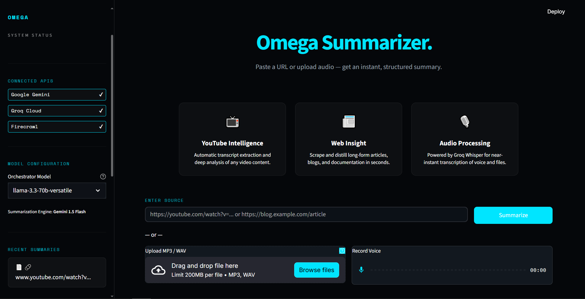
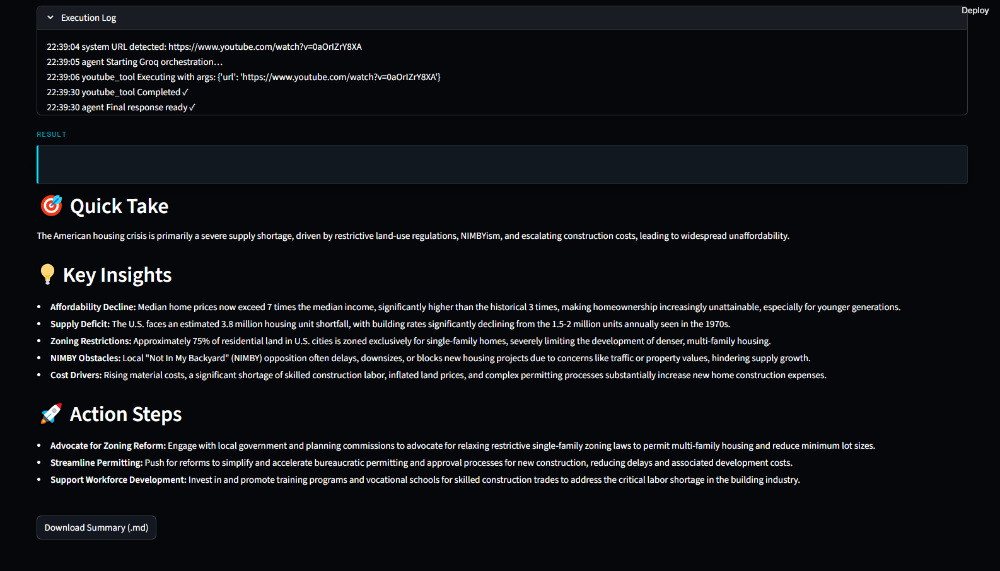

# ⚡ Omega-Summarizer

**Omega-Summarizer** is a production-grade, agentic AI system designed to distill vast amounts of information into actionable, structured insights. Whether it's a 2-hour YouTube video, a complex technical article, or a private voice recording, Omega-Summarizer handles the heavy lifting using a high-performance multi-model pipeline.



## 🌟 Vision
In an era of information overload, time is the most valuable currency. Omega-Summarizer aims to be the ultimate filter, extracting the signal from the noise with near-instant speed and clinical precision.

## 🚀 Core Capabilities

-   **📺 YouTube Intelligence**: Automatically extracts transcripts and performs deep semantic analysis on any video content.
-   **📰 Web Insight Engine**: Scrapes and distills long-form articles, blogs, and documentation while maintaining source context.
-   **🎙️ Audio Transmutation**: High-speed transcription via **Groq Whisper** (whisper-large-v3-turbo), converting spoken words into structured summaries in seconds.
-   **🤖 Agentic Orchestration**: Uses a **Llama-3.3-70B** orchestrator to intelligently route tasks between scraping, transcription, and summarization tools.
-   **⚡ Gemini-Powered Synthesis**: Leverages **Gemini 1.5 Flash** for final content distillation, ensuring high accuracy and structured formatting.



## 🛠️ Tech Stack & Infrastructure

Our architecture is built for speed and reliability, utilizing the fastest inference engines available today:

| Component | Technology | Provider |
| :--- | :--- | :--- |
| **Frontend** | Streamlit (Custom CSS) | Python |
| **Orchestrator** | Llama 3.3 70B | Groq |
| **Summarizer** | Gemini 1.5 Flash | Google |
| **Transcription** | Whisper Large v3 Turbo | Groq |
| **Web Scraping** | Firecrawl / Trafilatura | Firecrawl |
| **YouTube API** | youtube-transcript-api | Community |

## 📦 Installation & Setup

Ensure you have Python 3.9+ installed on your system.

### 1. Clone & Navigate
```bash
git clone https://github.com/Abdullah-Zafarr/universal-summarizer.git
cd universal-summarizer
```

### 2. Virtual Environment (Recommended)
```bash
python -m venv .venv
source .venv/bin/activate  # On Windows: .venv\Scripts\activate
```

### 3. Install Dependencies
```bash
pip install -r requirements.txt
```

### 4. Environment Configuration
Create a `.env` file in the root directory and add your credentials:
```env
GOOGLE_API_KEY=your_gemini_key
GROQ_API_KEY=your_groq_key
FIRE_CRAWL_KEY=your_firecrawl_key
```

### 5. Launch the System
```bash
streamlit run app.py
```

## 🧠 How It Works (The Agent Loop)

1.  **Input Analysis**: The user provides a URL or Audio file.
2.  **Strategic Planning**: The Groq Orchestrator determines the input type and identifies the necessary tool (`article_tool`, `youtube_tool`, or `audio_tool`).
3.  **Data Extraction**: The selected tool performs its task (scraping or transcribing) and retrieves the raw text.
4.  **Full-Context Distillation**: The raw content is sent to Gemini 1.5 Flash. Unlike RAG-based systems, we process the **entire context** at once for maximum coherence.
5.  **Structured Delivery**: The agent returns a Markdown-formatted summary containing a "Quick Take," "Key Insights," and "Action Steps."

## 🔑 Required API Keys

-   **Google Gemini**: [Sign up here](https://aistudio.google.com/) for a free/pro tier key.
-   **Groq Cloud**: [Get your key](https://console.groq.com/) for lightning-fast Llama and Whisper inference.
-   **Firecrawl**: [Get a key](https://www.firecrawl.dev/) for high-quality web scraping.

---
*Built for the future of information gathering. ⚡ Omega Team.*
