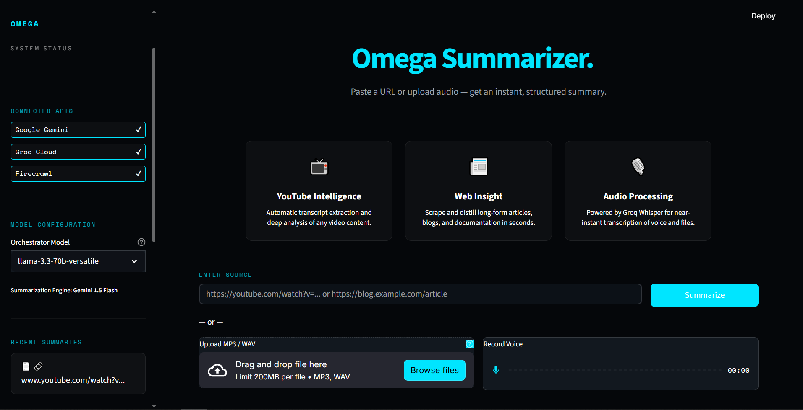
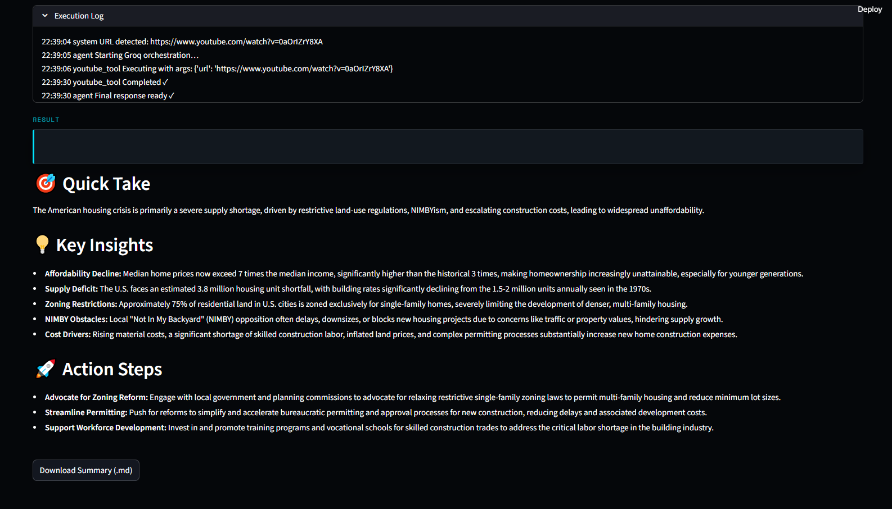

# ⚡ Omega-Summarizer


**Omega-Summarizer** is a production-grade, agentic AI system designed to distill vast amounts of information into actionable, structured insights. Whether it's a 2-hour YouTube video, a complex technical article, or a private voice recording, Omega-Summarizer handles the heavy lifting using a high-performance multi-model pipeline.



## 🌟 Vision
In an era of information overload, time is the most valuable currency. Omega-Summarizer aims to be the ultimate filter, extracting the signal from the noise with near-instant speed and clinical precision.

## 🚀 Core Capabilities

-   **📺 YouTube Intelligence**: Automatically extracts transcripts and performs deep semantic analysis on any video content.
-   **📰 Web Insight Engine**: Scrapes and distills long-form articles, blogs, and documentation while maintaining source context.
-   **🎙️ Audio Transmutation**: High-speed transcription via **Groq Whisper** (whisper-large-v3-turbo), converting spoken words into structured summaries in seconds.
-   **🤖 Agentic Orchestration**: Uses a **Llama-3.3-70B** orchestrator to intelligently route tasks between scraping, transcription, and summarization tools.
-   **⚡ Gemini-Powered Synthesis**: Leverages **Gemini 1.5 Flash** for final content distillation, ensuring high accuracy and structured formatting.
-   **🔄 Retry Resilience**: Exponential backoff retry logic for all API calls, ensuring reliability under transient failures.
-   **🎯 Smart Prompts**: Content-type-specific summarization prompts (article, video, audio) for maximum output quality.



## 🛠️ Tech Stack & Infrastructure

Our architecture is built for speed and reliability, utilizing the fastest inference engines available today:

| Component | Technology | Provider |
| :--- | :--- | :--- |
| **Frontend** | Streamlit (Custom CSS) | Python |
| **Orchestrator** | Llama 3.3 70B | Groq |
| **Summarizer** | Gemini 1.5 Flash | Google |
| **Transcription** | Whisper Large v3 Turbo | Groq |
| **Web Scraping** | Firecrawl / Trafilatura | Firecrawl |
| **YouTube API** | youtube-transcript-api | Community |

## 📁 Project Structure

```
omega-summarizer/
├── app.py              # Main Streamlit entry point and agent loop
├── tools.py            # Agentic tools (scraping, transcription, YouTube)
├── prompts.py          # System prompts, summarization templates, prompt builder
├── constants.py        # Centralized configuration constants
├── config.py           # Configuration manager with dataclass-based settings
├── utils.py            # Input validation, URL parsing, text processing
├── exceptions.py       # Custom exception hierarchy for error handling
├── logger.py           # Structured logging and execution log tracking
├── test_api.py         # Comprehensive test suite with assertions
├── requirements.txt    # Python dependencies (categorized)
├── .env.example        # Environment variable template
├── .gitignore          # Git ignore rules
├── README.md           # This file
└── assets/             # Screenshots and visual assets
```

## 🧠 Architecture Overview

```
┌─────────────────────────────────────────────────┐
│                   USER INPUT                     │
│          (URL / Audio File / Recording)          │
└───────────────────┬─────────────────────────────┘
                    │
                    ▼
┌─────────────────────────────────────────────────┐
│            GROQ ORCHESTRATOR                     │
│         (Llama 3.3 70B Versatile)               │
│                                                  │
│   ┌──────────┐ ┌──────────┐ ┌──────────────┐   │
│   │ article  │ │ youtube  │ │    audio     │   │
│   │  _tool   │ │  _tool   │ │    _tool     │   │
│   └────┬─────┘ └────┬─────┘ └──────┬───────┘   │
└────────┼────────────┼───────────────┼───────────┘
         │            │               │
         ▼            ▼               ▼
  ┌──────────┐ ┌───────────┐  ┌─────────────┐
  │ Firecrawl│ │ Transcript│  │ Groq Whisper│
  │   or     │ │   API     │  │   (STT)    │
  │Trafilat. │ │  + Gemini │  │            │
  └────┬─────┘ └─────┬─────┘  └──────┬──────┘
       │              │               │
       └──────────────┼───────────────┘
                      │
                      ▼
        ┌─────────────────────────┐
        │    GEMINI 1.5 FLASH     │
        │  (Content Distillation) │
        │                         │
        │  • Smart Prompt Builder │
        │  • Type-Specific Output │
        │  • Retry with Backoff   │
        └────────────┬────────────┘
                     │
                     ▼
        ┌─────────────────────────┐
        │   STRUCTURED SUMMARY    │
        │  🎯 Quick Take          │
        │  💡 Key Insights        │
        │  🚀 Action Steps        │
        └─────────────────────────┘
```

## 📦 Installation & Setup

Ensure you have Python 3.9+ installed on your system.

### 1. Clone & Navigate
```bash
git clone https://github.com/Abdullah-Zafarr/universal-summarizer.git
cd universal-summarizer
```

### 2. Virtual Environment (Recommended)
```bash
python -m venv .venv
source .venv/bin/activate  # On Windows: .venv\Scripts\activate
```

### 3. Install Dependencies
```bash
pip install -r requirements.txt
```

### 4. Environment Configuration
Create a `.env` file in the root directory and add your credentials:
```env
GOOGLE_API_KEY=your_gemini_key
GROQ_API_KEY=your_groq_key
FIRE_CRAWL_KEY=your_firecrawl_key
```

### 5. Launch the System
```bash
streamlit run app.py
```

### 6. Run Tests (Optional)
```bash
python test_api.py          # Full test suite
python test_api.py --quick  # Offline tests only
```

## 🧠 How It Works (The Agent Loop)

1.  **Input Analysis**: The user provides a URL or Audio file.
2.  **Strategic Planning**: The Groq Orchestrator determines the input type and identifies the necessary tool (`article_tool`, `youtube_tool`, or `audio_tool`).
3.  **Data Extraction**: The selected tool performs its task (scraping or transcribing) with automatic retry on transient failures.
4.  **Smart Prompt Selection**: The prompt builder selects a content-type-specific template for maximum summarization quality.
5.  **Full-Context Distillation**: The raw content is sent to Gemini 1.5 Flash. Unlike RAG-based systems, we process the **entire context** at once for maximum coherence.
6.  **Structured Delivery**: The agent returns a Markdown-formatted summary containing a "Quick Take," "Key Insights," and "Action Steps."

## 🔑 Required API Keys

-   **Google Gemini**: [Sign up here](https://aistudio.google.com/) for a free/pro tier key.
-   **Groq Cloud**: [Get your key](https://console.groq.com/) for lightning-fast Llama and Whisper inference.
-   **Firecrawl**: [Get a key](https://www.firecrawl.dev/) for high-quality web scraping.

## 🤝 Contributing

Contributions are welcome! Here's how to get started:

1. Fork the repository
2. Create a feature branch (`git checkout -b feat/your-feature`)
3. Make your changes and add tests
4. Run the test suite: `python test_api.py --quick`
5. Commit with a descriptive message (`git commit -m "feat: add your feature"`)
6. Push and open a Pull Request

### Commit Convention
- `feat:` — New feature or capability
- `fix:` — Bug fix
- `refactor:` — Code restructuring without behavior change
- `test:` — Adding or updating tests
- `chore:` — Maintenance, dependencies, configs
- `docs:` — Documentation updates

## 📄 License

This project is open-source under the [MIT License](LICENSE).

---
*Built for the future of information gathering. ⚡ Omega Team.*

